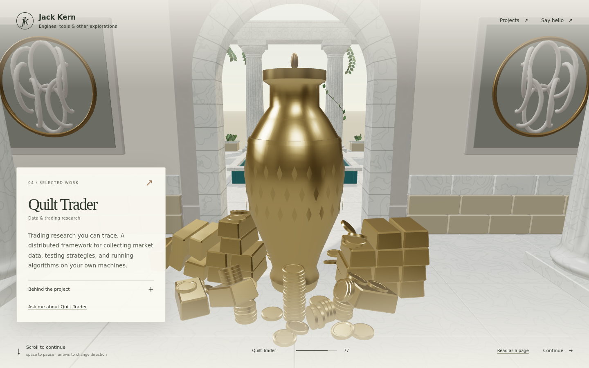

# Quilt Trader gold treasury — 2026-09-16

The room now has a fully gold vessel, **26 bullion bars and 102 coins**. Two staggered bullion stacks, six coin columns and loose drops were settled with Matter Engine's native ECS/Box3D physics. The website renders the resulting arrangement as two instanced mesh batches; no physics runs in the browser.

[Open the room on the LAN](http://192.168.1.69:8000/?vp=11).



## Native authoring and bake

The frozen **MatterEditor 2026-09-16-r2** runtime was hash-verified by its launcher. Only project JavaScript was authored; engine code, binaries, helper libraries and launchers were unchanged. Source lives in the main Matter checkout and its frozen authoring project:

- `projects/world_demo/scenes/architecture/villa/VillaGoldTreasury/`
- `projects/world_demo/shared-lib/villa_gold_treasury.js`

The vessel reuses the approved vase geometry, including its interior and raised diamond band, with one gold material throughout. Bars have beveled, tapered sides; coins have raised rims and recessed faces. The shared PBR gold recipe uses metalness 1 and roughness 0.27.

The simulation uses 10× scale to improve contact accuracy for thin coins. Dynamic convex hull colliders settle against a static floor and vase proxies. After 30 seconds of native Play at 2×, poses were captured while paused; a further 10 seconds of Play produced **zero change in all 128 matrices**. All 128 bodies moved from their authored drop positions. [Native settle checks](settle-check.json), [initial poses](before.json), [settled poses](settled-final.json), [native editor view](native-settled.png).

The native coin collision hulls have 16 sides; render geometry has 48. During conversion, 36 floor contacts received a vertical correction ranging from fractions of a millimetre to 7.59 mm to keep render vertices above the floor. Orientations and horizontal positions remain native simulation results. The original receipts are retained, and every correction is recorded. Other stacked pieces retain their native height.

All three parts were exported through `asset.export` as OBJ/MTL, GLB, PBR maps and 16-bit height maps. The native masters remain outside the website's public directory:

```text
D:\Shared With Desktop\AI\matter-engine-cpp\MatterEditor\build\asset-handoff\2026-09-16-r2\pilot-output\villa-gold-treasury-20260916\
```

[Export receipts](native-export-results.json), [master file hashes](master-files.json), [source hashes](source-manifest.json), [authored source snapshot](source/).

## Delivery

| Shared mesh | Triangles | Raw GLB | gzip estimate |
| --- | ---: | ---: | ---: |
| Gold vase | 3,216 | 110,248 B | 66,618 B |
| Bar | 60 | 5,752 B | 3,222 B |
| Coin | 576 | 17,708 B | 10,180 B |

There is no mesh simplification. Meshopt compression uses 16-bit positions/UVs; constant PBR maps reduce to single pixels and remaining maps use lossless WebP. Desktop and mobile share the same small geometry. The new bar and coin meshes together are **23,460 bytes**, plus about 7 KB compressed for the placement table and integration code. The gold vase replaces the previous 125.6 KB desktop / 120.0 KB mobile vase. [Packing report](packing-report.json).

Native and packed GLBs pass Khronos validation with zero errors and warnings. Separate Meshopt decoding checks retained triangle counts and bounds. gzip/Brotli figures are offline estimates: actual preview transfer uses raw files unless the host enables HTTP compression.

## Website verification

The piles follow the vase's placement transform, stay in Quilt Trader's streaming group, share loaded geometry/materials, and cast/receive the existing runtime shadows. The kit now contains 23 unique exported mesh types and the scene has 585 placements. Existing camera paths and input mappings are unchanged by this asset addition.

- All 133 tests / 35 files pass, including dense camera clearance, composition, deterministic QuickJS layout, project pauses and forward/reverse input.
- TypeScript and manifest/contract validation pass.
- [Production browser review](browser-report.json) covers room entry and the reading stop at desktop and mobile widths, with every gold mesh loaded from Matter and no console warnings, errors or failed requests. Mobile is viewport emulation, not a physical-device performance measurement.
- Desktop/mobile byte budgets pass. Static fallback images are regenerated from the completed build.

To reproduce after the native exports and settle capture:

```sh
python3 tools/assets/capture-treasury.py /mnt/c/tmp/villa-gold-treasury-20260916
node tools/assets/assemble-treasury.mjs '/path/to/matter-engine-cpp/projects/world_demo'
node tools/assets/pack-treasury.mjs '/path/to/native/masters'
npm run typecheck
npm run validate
npm test
npm run build
node tools/assets/review-treasury.mjs http://192.168.1.69:8000
```

Run treasury packing after `pack-kit.mjs`, since this pass replaces the kit's original `urn-large` export. The native capture script expects a freshly loaded, paused VillaGoldTreasury session with the raster command/result files; Play/Stop changes to that session invalidate the before/after comparison.
