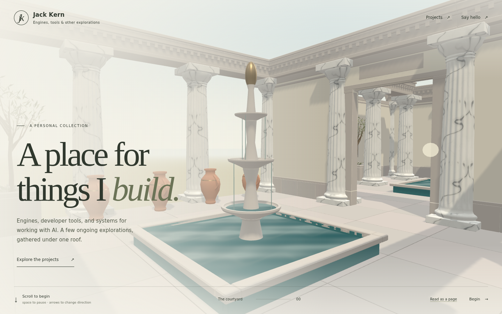

# Matter villa kit — 2026-09-16

This records the initial kit delivery. The subsequent [garden and architecture pass](../garden-pass/README.md) updates placements, marble finishes, planting, water and atmosphere.

The website now uses **21 exported Matter assets** by default, arranged into **441 instances**. Twenty new assets join the approved marble column. [Open the current local build](http://localhost:4321/). `?assets=greybox` retains the stand-in comparison; `?assetTier=mobile` forces the smaller deliveries.



## Authored objects

| Asset | Triangles | Placements | Desktop kB | Mobile kB |
| --- | ---: | ---: | ---: | ---: |
| `column-doric` | 8,680 | 92 | 360.5 | 298.9 |
| `wall-3m` | 480 | 40 | 29.7 | 20.8 |
| `wall-3m-doorway` | 780 | 8 | 39.9 | 28.8 |
| `entablature-3m` | 1,980 | 86 | 77.6 | 60.3 |
| `floor-slab-3x3` | 300 | 88 | 33.4 | 19.2 |
| `pool-basin-3x3` | 2,700 | 6 | 68.9 | 65.5 |
| `pool-edge-straight` | 60 | 24 | 14.2 | 7.7 |
| `pool-edge-corner` | 60 | 24 | 9.7 | 7.0 |
| `fountain-tiered` | 4,848 | 5 | 201.8 | 168.9 |
| `fountain-wall` | 1,928 | 1 | 119.6 | 88.5 |
| `planter-square` | 600 | 10 | 43.3 | 30.2 |
| `stair-run-3m` | 600 | 1 | 40.5 | 26.0 |
| `urn-small` | 2,656 | 15 | 100.2 | 96.2 |
| `statue-a` | 2,292 | 8 | 110.5 | 99.0 |
| `bench-3m` | 360 | 2 | 37.5 | 23.0 |
| `statue-b` | 1,748 | 1 | 83.8 | 71.5 |
| `relief-a` | 5,236 | 1 | 202.8 | 188.8 |
| `urn-large` | 3,216 | 1 | 125.6 | 120.0 |
| `olive-small` | 2,422 | 10 | 116.2 | 94.7 |
| `ground-plant-clump` | 640 | 10 | 51.8 | 35.8 |
| `wall-inset-panel` | 3,192 | 8 | 167.8 | 133.0 |

Total unique geometry: **44,778 triangles**, unchanged by compression. Models use metres, +Y up, local placement origins, and bounds checked against the authored catalog. Column shafts, cornices, coping, furniture, plants and project sculptures are actual geometry exported by MatterEditor. The four project focal pieces are a carved wall fountain, layered marble sculpture, bronze network relief, and a ceramic mosaic vessel. Planters contain opaque geometric olive leaves and herbs, avoiding alpha sorting and foliage overdraw.

## Authoring and native exports

Frozen runtime: **MatterEditor 2026-09-16-r2**, with runtime hashes verified before launch. No engine code, binaries, helpers or launchers were modified. Only project JS was authored. All new sources were copied back into the main Matter checkout:

```text
D:\Shared With Desktop\AI\matter-engine-cpp\projects\world_demo\scenes\architecture\villa\VillaWebsiteKit
D:\Shared With Desktop\AI\matter-engine-cpp\projects\world_demo\shared-lib\villa_website_kit.js
```

The world arranges all twenty new parts in a spaced inspection grid. It uses eleven shared material recipes with stone and marble detail. The exporter bakes a material atlas for each unique part; website instances share each part's geometry/material/textures. This is not a cross-part texture atlas.

Native masters remain outside the website's public folder:

```text
D:\Shared With Desktop\AI\matter-engine-cpp\MatterEditor\build\asset-handoff\2026-09-16-r2\pilot-output\villa-kit-20260916-204523\masters\<asset-id>
D:\Shared With Desktop\AI\matter-engine-cpp\MatterEditor\build\asset-handoff\2026-09-16-r2\pilot-output\villa-column-export-20260916-201713\export-master
```

Each master package contains OBJ/MTL, GLB, PBR texture maps, gray16 height and the native manifest. Exports use the published world root at LOD 0. Initial requests were safely rejected while deferred detail bakes were pending; all twenty subsequently succeeded. [Export receipts](native-export-results.jsonl), [source hashes](source-manifest.json), [native file hashes](master-files.json), [native editor grid](native-editor-grid.png), [source geometry checks](geometry-checks.json).

## Delivery and rendering

| Entire 21-part kit | Desktop | Mobile |
| --- | ---: | ---: |
| Raw GLBs | 2.036 MB | 1.684 MB |
| gzip estimate | 1.468 MB | 1.122 MB |
| Brotli estimate | 1.405 MB | 1.059 MB |
| Texture images inside GLBs | 622 kB | 271 kB |
| Decoded RGBA8 textures + mipmaps, estimate | 119.4 MiB | 35.6 MiB |
| Entry's three-stop GLB responses | 1.545 MB | 1.255 MB |

Decimal MB for files, binary MiB for memory. Entry figures exclude JS/CSS/HTML and browser overhead. Compressed transfer sizes are offline estimates; the local preview serves raw GLBs. A production server can negotiate gzip/Brotli with HTTP headers; the site does not fetch `.gz` files directly.

Meshopt high compression uses 16-bit positions/UVs and filtered 8-bit normals/tangents; no simplification. Every final file is decoded again to verify triangle count and bounds within 1 mm. WebP quality 92 is used for color; data maps are lossless after resizing. Exactly constant maps become a single exact pixel. The column retains its approved 2048/1024 maximum image edges; other assets use 512/256 and hero color maps 768/384. Representative medium/high compression comparisons showed no pixel differences over the 0.1 perceptual threshold at the tested column and room views; see [column comparison](compression/report.json), [room comparison](compression/room-report.json), and the retained images. This is a sampled visual check, not proof of bit-identical shading.

WebP saves download bytes but expands on the GPU. Memory estimates exclude framebuffers, geometry, shadows and driver overhead. KTX2/Basis remains a possible future GPU-memory improvement. The current mobile tier already cuts estimated texture memory by about 70%. Browser viewport checks do not substitute for a physical-phone performance test.

The website shares the 21 assets across instanced batches, streaming the current stop, two ahead and three behind. Loaded part data is cached for reuse; instance buffers outside that window are released. The reviewed views reached at most 103 draw calls and about 499k rendered triangles, including shadow passes. These are scene counters, not measured mobile frame rates.

Water uses a small procedural shader and simple fountain ribbons; no downloaded normal maps or full-screen refraction buffer. Motion pauses with the tour. Daylight uses a generated environment, sun shadows and a simple sky. **Lighting is runtime lighting, not a Matter illumination bake.** The r2 exporter supports static opaque assets. POM is not enabled; the original height masters remain available for later evaluation.

## Website changes and checks

- Matter assets are the default. Missing individual exports fall back to stand-ins.
- The loader applies glTF node transforms before instancing, preserves material groups and mirrored winding, and checks local bounds.
- Coping, olive planting, herbs, wall medallions and terrace benches use deterministic placements. A smaller network-relief display scale fits its room; portrait framing keeps focal art above the floating pane.
- The existing continuous cruise and floating panes remain. Route clearance, footing, headroom and quarter-metre composition checks cover the updated layout.
- All native and packed GLBs pass Khronos validation with zero errors/warnings. The validator cannot inspect Meshopt payloads itself; separate decoding and actual Three.js rendering cover those payloads.
- All 14 viewpoints render on desktop and mobile with every placed asset type loaded and no browser errors, warnings or failed requests. [Browser report](browser-report.json), [mobile Quilt Trader](views/mobile-quilt-trader-focal.png), [mobile Agent Queue](views/mobile-agent-queue-focal.png).
- Type checking, manifest/contract validation and all 118 tests pass. Budget tooling now counts the selected Matter tier, embedded textures, and shared first-window assets once.

- Thirteen between-landmark captures also load cleanly; see the [flight report](flight/report.json).
- The [production behavior check](behavior-report.json) verifies continued flight after Begin, missing-asset fallback, static reading mode without GLB requests, and graphics reset with zero changed pixels at the tested view. Generated environment lighting is released before context restoration and rebuilt afterward.
- All fourteen static fallback captures were regenerated and visually reviewed; their expected image baselines were updated for the new kit.

Detailed final checks are recorded in [verification.json](verification.json). The original asset list's optional product screenshots and baked illumination are separate from this completed 3D kit; the current site uses factual project copy and runtime lighting.

## Reproduce

```sh
npm ci --prefix tools/assets
node tools/assets/pack-kit.mjs '/path/to/kit/masters' '/path/to/column/export-master'
npm run typecheck
npm run validate
npm test
npm run build
node tools/assets/review-kit.mjs http://127.0.0.1:4321
node tools/assets/verify-kit.mjs http://127.0.0.1:4321
npm run budgets
node tools/budgets.mjs dist mobile
npm run check:links
```

Launch the native inspection world with the frozen runtime and `-World VillaWebsiteKit -TextureDensity 128`; wait for all detail bakes to publish before `asset.export`. The export automation editor was closed after the native packages and source copies were complete.
