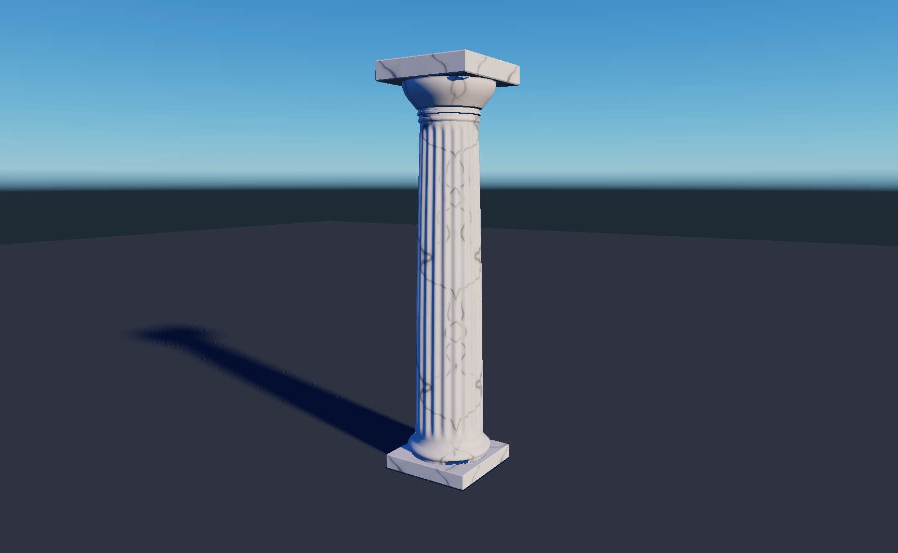

# MatterEngine pilot: fluted villa column

Created 2026-09-16 in the pinned native MatterEditor `2026-09-16-r1` build.
These are actual editor captures of the JavaScript-authored asset.

**Export update:** the r2 build now exports the pilot successfully. The native
OBJ/MTL, GLB, PBR maps and 16-bit height are preserved, and compressed browser
variants are available in the [local villa preview](http://localhost:4321/?assets=matter).
See [export results, sizes and reproduction steps](export/README.md).

[Marble capital](marble/marble-capital.png) · [Marble base](marble/marble-base.png) · [Original limestone](column-final.png)

## Marble finish

The current editor scene uses white marble with irregular grey mineral veins,
fainter secondary threads, and a lightly polished finish. Its procedural recipe
is `projects/world_demo/shared-lib/villa_marble_pilot.js` in MatterEngine.

This follows the handoff's `conifer_bark.js` example: a coloured source mesh is
baked to a reusable albedo/normal/height/ORM atlas. The source mesh is bake-only;
the column remains 8,680 triangles. The 1.28 m tile has 512 x 512 texels per
atlas layer. The source recipe is 3,114 bytes (1,536 bytes gzipped); this is not
the final texture download size. The native sixteen-layer cache is an editor
artifact, not a web delivery format.

Native baking succeeded and three editor captures were inspected at
1728 x 1065. Colour and height match across both tile boundaries to within
1.1e-14; relief is under eight micrometres, so the veins do not create cracks
or ridges. [Material checks](marble/material-verification.json) and
[capture receipts](marble/capture-results.json) record the result.
The [recipe swatch](marble/marble-recipe-swatch.png) is a direct RGB evaluation
of the procedural recipe, separate from the editor screenshots.

The original limestone evidence below is retained for comparison. The current
scene and new material sources were also copied back to the MatterEngine
checkout. The exported column is integrated in the website's opt-in Matter preview.

## Result

The initial pilot was a limestone column with twenty flutes, tapered shaft, rounded
mouldings, bevelled base/capital and a reusable procedural stone-grain tile.
It occupies exactly 1 x 1 x 4 metres. Open `VillaDoricColumnStudy` for inspection;
F11 toggles the panels.

Launch again using
`D:\Shared With Desktop\AI\matter-engine-cpp\MatterEditor\build\asset-handoff\launch.cmd`.
The stable launcher now opens r2, which includes the pilot and export tools.

Authored sources were copied back to the MatterEngine checkout:

- `projects/world_demo/scenes/architecture/villa/VillaDoricColumnStudy/`
- `projects/world_demo/shared-lib/villa_doric_pilot.js`

The handoff copy remains editable and is the one this frozen editor loads.
Its `asset-example-inventory.json` catalogues the 270 existing project JS
examples reviewed for the trial, with representative geometry, materials,
brick, terrain and vegetation implementations examined in depth.

| Recipe quality | Triangles |
| --- | ---: |
| 0 — close inspection | 8,680 |
| 1 — medium | 5,440 |
| 2 — distant | 3,440 |

These are authored variants; runtime distance-based LOD selection is not yet
connected. The source recipe is 6,068 bytes, or 2,684 bytes gzipped. Those are
**source** sizes, not finished asset download sizes. The engine's sixteen-layer
stone tile cache occupies 2,362,656 bytes and is not a web asset.

## Evidence

- Native column/ground geometry baked with zero errors; the final stone tile
  also baked successfully. Initial tileset code had to use the built-in stone
  palette because `defineMaterial` is unavailable in the tileset evaluator.
- All three mesh variants passed checks for exact bounds, determinism, closed
  component seams, outward nondegenerate triangles, finite UVs and unit normals.
- The procedural height tile repeats continuously with under 1 mm total relief.
- Captures were checked at 1728 x 1084. See
  [geometry verification](geometry-verification.json) and
  [native capture receipts](final-capture-results.json).
- The handoff runtime hash verification passed after authoring; no engine
  binary, engine helper or automation tool was changed.

Run `node verify.mjs` inside the MatterEngine scene directory to repeat the
geometry checks. Native logs and the full iteration history are kept in the
handoff's `pilot-output/villa-column-01/` directory.

## Next decision

This proves the authoring/baking workflow. It still needs a material and lighting
polish pass: close views show a repeating fine-grain pattern and strong blue
shadow contrast. Review the column's proportions before producing the other
architectural assets.

The r2 exporter completes the mesh/UV/material handoff. The first browser trial
uses one compressed mesh and shared material for the 92 column placements,
loaded through `?assets=matter`. Review the close-up comparisons and fly-through
before promoting it to the default kit or producing further assets. KTX2 texture
compression and authored geometry LODs remain future trials; the current pilot
already preserves every triangle at approximately 0.52 MB desktop / 0.46 MB mobile.
