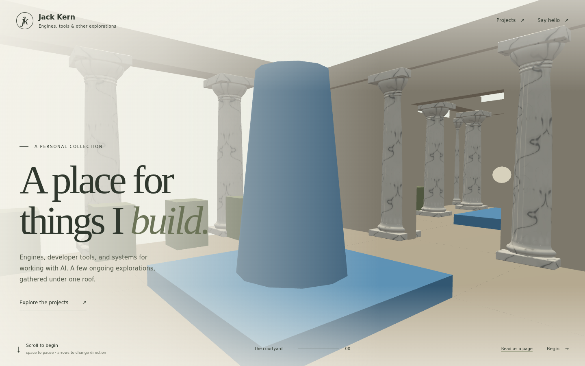

# Marble column: native export → browser pilot

Exported with the frozen MatterEditor **2026-09-16-r2** build on 2026-09-16.
Preview the column throughout the [local villa](http://localhost:4321/?assets=matter).
`assetTier=mobile` or `assetTier=desktop` can force a tier for comparison; otherwise
the viewport selects it at startup. The [completed 21-part kit](../../matter-kit/README.md) is now the default; `?assets=greybox` opens the stand-ins.

The measurements below document the original approved pilot. Its final delivery was subsequently repacked with the full kit; see that kit report for current sizes.



The agent command exported the exact published `VillaDoricColumnPilot` world root
at LOD 0. This avoids accidentally exporting different Workbench parameters. The
first request correctly returned `not_ready`; the second succeeded after the
bake became idle. [Receipts](native-export-results.jsonl) record both outcomes.
The automation editor was closed after export; the user's editor was left running.

## Native master

All thirteen original files are preserved in:

```text
D:\Shared With Desktop\AI\matter-engine-cpp\MatterEditor\build\asset-handoff\2026-09-16-r2\pilot-output\villa-column-export-20260916-201713\export-master
```

This contains `asset.obj`, `asset.mtl`, `asset.glb`, base color, tangent normals
(including the OBJ-specific normal map), ORM and individual channels, clearcoat,
16-bit height and the engine manifest. [File hashes and image checks](master-files.json)
identify the complete export. The GLB is byte-identical to the engine team's
independently validated r2 reference export.

Geometry has 8,680 triangles, a 1 × 4 × 1 metre envelope, +Y up and a centred
bottom origin. The browser loader preserves quantization's node transforms
before passing the mesh into the existing placement/instancing system.

## Delivery measurements

Decimal kB/MB; compressed sizes below are **offline estimates**. The local preview
serves the raw GLBs, and browser receipts confirm their actual response sizes.

| Version | GLB file | gzip estimate | Brotli estimate | Texture memory estimate |
| --- | ---: | ---: | ---: | ---: |
| Native master | 6.915 MB | 4.734 MB | 4.449 MB | 288 MiB |
| Desktop | 520.5 kB | 357.1 kB | 333.4 kB | 36 MiB |
| Mobile | 459.0 kB | 295.6 kB | 272.1 kB | 9 MiB |

Both derivatives retain all 8,680 triangles. Geometry uses
[Meshopt compression](https://gltf-transform.dev/modules/functions/functions/meshopt)
with 16-bit positions/UVs and 14-bit normals. Base color uses WebP quality 92;
normal/data images use lossless WebP after resizing. Desktop color/normal maps
are 1728 × 2048; mobile maps are 864 × 1024. Every texel in the original ORM and
clearcoat maps was verified identical, so each is replaced by one exact pixel.
This halves texture memory without altering those material values.

WebP reduces download size but decodes to ordinary GPU textures. Memory estimates
assume RGBA8 plus mipmaps; they exclude geometry, render targets and driver
overhead. KTX2/Basis is a future GPU-memory comparison. No `.gz` asset is loaded
directly; production transfer savings depend on negotiated HTTP compression.
See the [packing report](packing-report.json) for exact bytes and hashes.

## Appearance and checks

- Native and both compressed GLBs pass Khronos glTF validation with zero errors
  and warnings. The validator reports that it cannot inspect Meshopt payloads;
  the actual packed files are decoded separately to verify bounds and triangle
  counts, then loaded through Three.js's bundled Meshopt decoder in the browser.
- Three.js loads and renders all versions. Comparisons include an overview,
  capital and base under identical lighting. Compression keeps the silhouette
  and vein placement, with slight softening of the smallest veins at the mobile
  tier. Whole-frame mean RGB differences range from 0.016 to 0.138 byte values;
  background contributes to these metrics, so close-up images are the main evidence.
- Browser runs at 1440 × 900 and 390 × 844 select the intended asset tier and
  request one GLB. `KitLoader` shares its geometry/material; the existing
  `InstancedMesh` placement system repeats it throughout the villa.
- No browser errors, warnings or failed requests occurred in these runs.
  [Browser report](browser-report.json), [desktop capital](desktop-capital.png),
  [native-export capital](master-capital.png), [mobile capital](mobile-capital.png),
  [mobile villa](villa-mobile.png).
- Type checking, layout/content validation and the focused loader/instancing tests
  pass, including metre-scale preservation for quantized glTF nodes.
- The production build and static captures complete. Its [browser probe](production-probe.txt)
  passes at two viewpoints, including input and WebGL context restoration.
  [Cruising continues after Begin](cruise-check.json), and a deliberately missing
  GLB [falls back to the stand-in](fallback-check.json) while the 3D scene remains usable.

Browser captures use Chromium's SwiftShader renderer. The mobile test is viewport
emulation, not a physical-phone performance claim.

The separate height image is verified gray16. Its legacy padded datum is about
−0.548 m and stored samples span only 0–2; do not apply that offset as displacement.
The browser pilot uses standard PBR and does not enable POM. Vein repetition and
the existing villa lighting remain art-direction considerations for the next pass.

## Reproduce

Authoring/export stays in the frozen Matter snapshot. Packing tools have their own
locked dependencies, separate from the site's runtime dependencies.

```sh
npm ci --prefix tools/assets
node tools/assets/pack-column.mjs '/path/to/export-master'
# With a local Vite dev server running on port 4322:
node tools/assets/verify-column.mjs '/path/to/export-master' http://127.0.0.1:4322
npm run typecheck
npx vitest run tests/kit/matter.test.ts tests/kit/loader.test.ts tests/scene
npm run validate
npm run build
```

Only the two browser GLBs and their manifest enter `public/assets/matter/`.
The reference OBJ/PNG package remains in the Matter authoring workspace.
